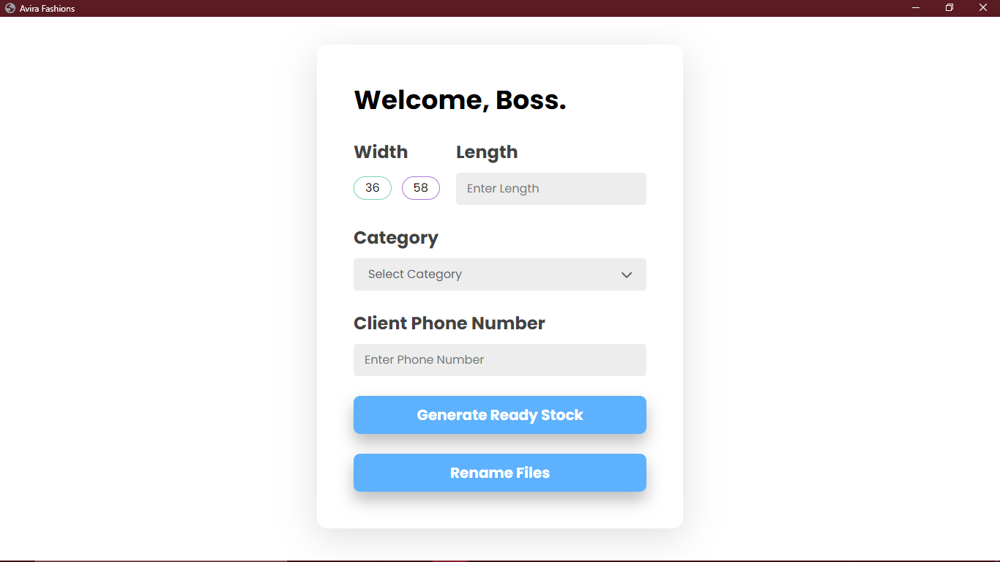

# Automate
***
>Some data, some assets and an internet connection is all you need, to **Automate**!

*Automate* is a **Desktop Application** which can be used in your **Business** to automate some task. This application takes **data from an Excel sheet** which might have **records of the products which you sell or manufacture**. **Using the GUI**, you can **apply filters** on that data, after which the **application will separate the images of the products which are currently present in stock** and **store it in a new folder**. Also, if you **enter the phone number** of a client, the application will **automatically send images of the filtered samples via WhatsApp** making your task even more easier.

I developed this software application for **textile firm** which **manufactures and sells fabrics for men’s clothing**. Whenever a client approaches them with some demand, they must be able to respond to it as soon as possible reason being client’s in textile industry have got many options, so there are early bird advantages for the firm which sends them the designs first. 

## Tech Stack
***
**Frontend** - HTML, CSS, JavaScript
**Backend** - Python, Selenium, Eel


## Project Snippet
***



## Note
***
Currently, this application is based on client specific requirements. A detailed demonstration of this application can be viewed using the below YouTube link.
```bash
Coming Soon
```
To run this application on your local system, kindly contact me on ***tanmaysm1711@gmail.com***.


